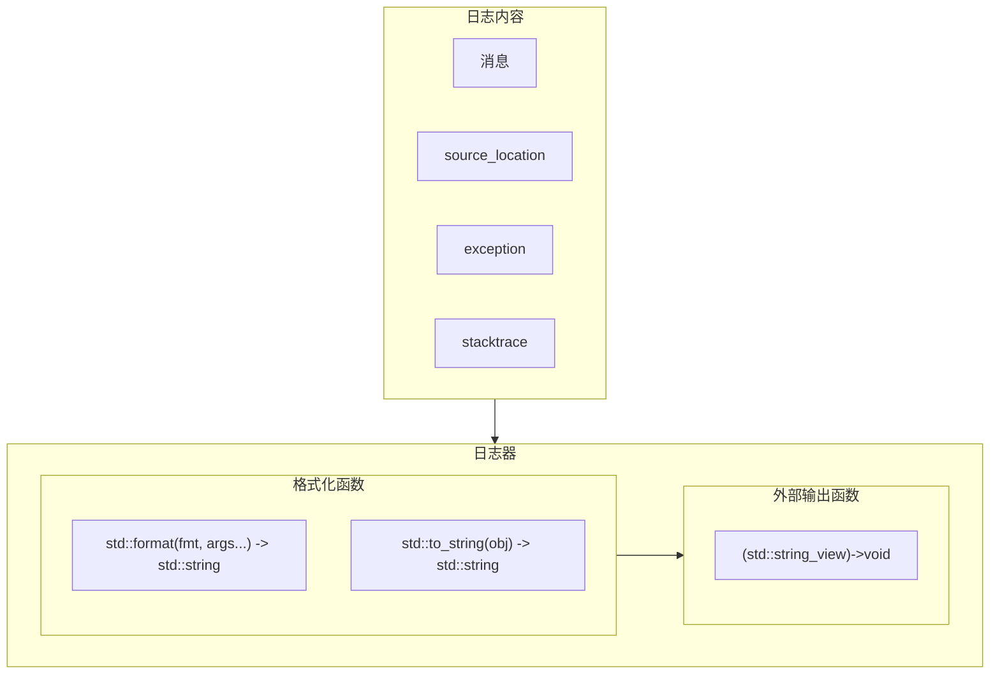

# cango.logging

## 简介

这是一个 c++23 单头文件日志库，仅利用标准库实现。

此库使用标准库描述日志过程：



## 使用方法

在源码中包含[头文件](./include/cango/logging.hpp)，下面给出一个使用例子：

```cpp
// 给定输出函数，这里以 std::cout 为例
auto output_func = [](std::string_view str) noexcept { // 这里的 noexcept 标记意思是你需要自己处理这个函数的异常，否则会导致程序崩溃
    std::cout << str;
};

// 创建日志器
cango::logging::CangoLogger<decltype(output_func)> logger{output_func, "日志器名称"};

// 输出日志
l.debug_if<PROJECT_DEBUG_MODE>("my var({})", my_var);

l.info(std::source_location::current(), "hello {}", "world!");
```

输出结果（此处省略路径信息）：

```text
[2025-04-27 08:48:09.8415501][info](日志器名称)> hello world!
Source: ...\test.cpp:28
```

## 注意事项

1. 你需要自己处理输出函数的异常，否则会导致程序崩溃
2. 当日志器格式化失败（一般是 std::bad_alloc 异常），会导致程序崩溃
3. 如果你需要在多线程中使用日志器，那么你需要处理输出函数的线程安全问题，
   你可以使用 std::mutex 或 std::atomic 来保证线程安全。
4. 严格来说，此仓库只是提供了简单的抽象和基础的实现，需要根据具体需求做适当的修改和扩展
