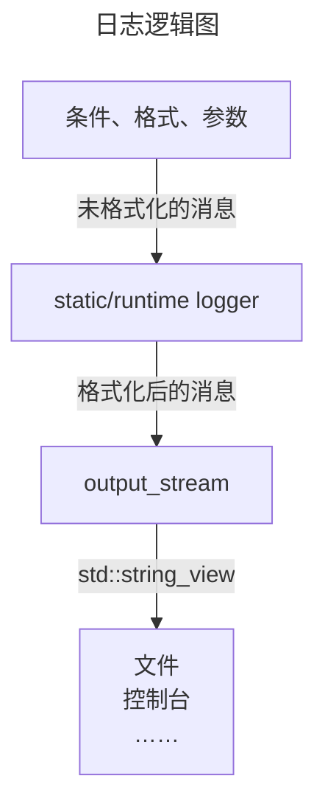

# cango.logging.core API 文档

## static&runtime 静态与运行期

静态对象是指，在代码的编译过程中就已经明确的对象。  
`static logger` 指在编译期就确定了使用何种输出流的日志器。  
`runtime logger` 指在编译期确定使用在运行时给定输出流的日志器。  

`runtime_stream` 提供了在运行期指定输出流的功能。  
